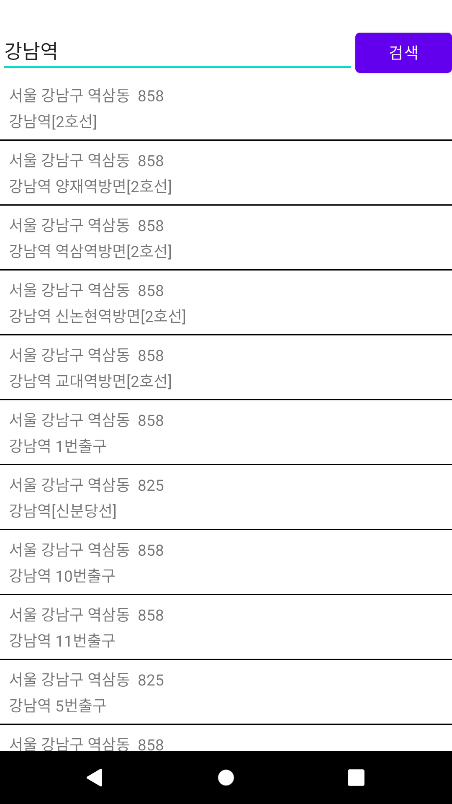
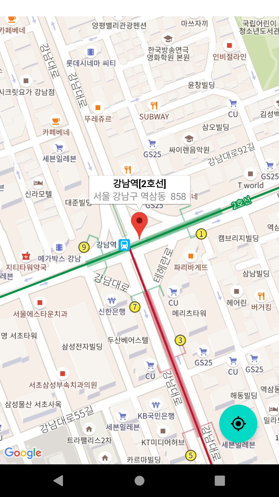
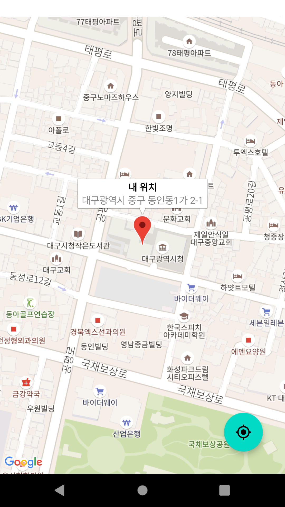

# Android Clone Coding Project #18 지도
TMAP POI를 통해 지도 검색을 할 수 있음
 
Google Map을 통해 지도를 보여 줄 수 있음
 

# 결과화면
|Screenshot1|Screenshot2|
|---|---|
|||
|||

 

# 배운 내용 정리
- Tmap POI 알아보기
- Google Map 알아보기
- Retrofit2 사용하기
- Coroutines 사용하기
